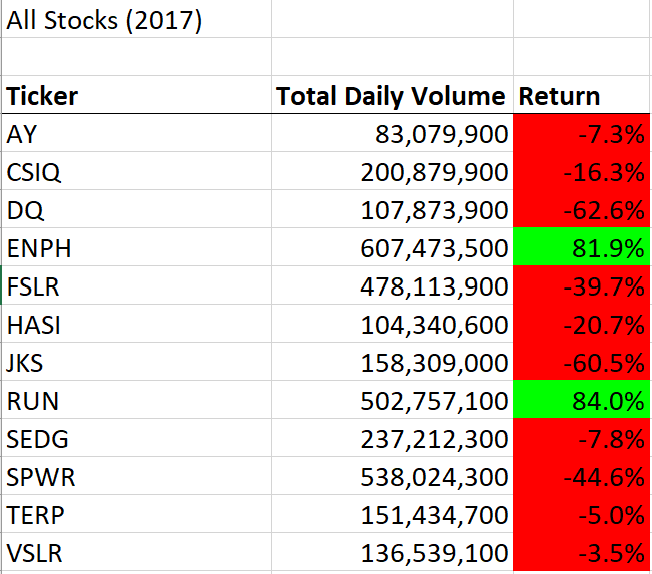
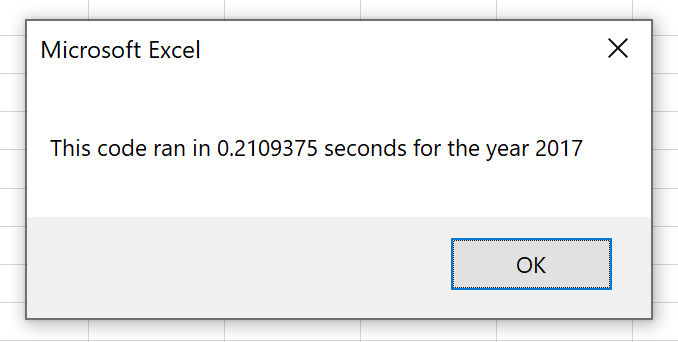
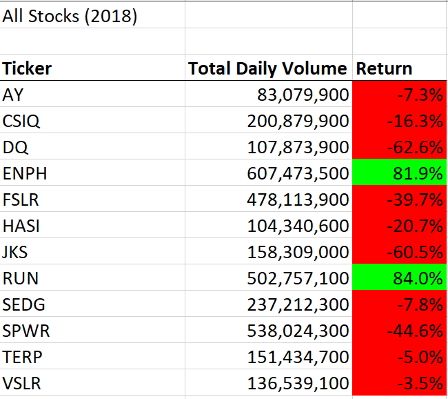
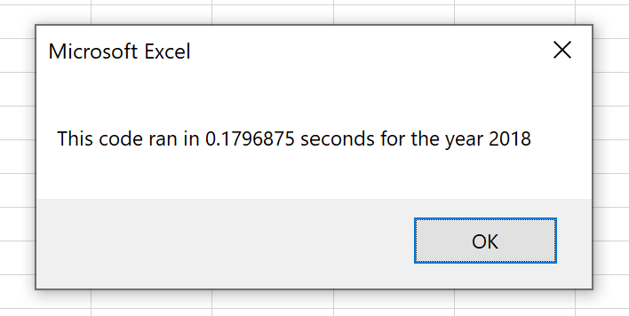

# VBA Module (Stock analysis)

## Overview of Project

### Purpose
The purpose of the stock analysis project is to help Steven and his parents decide if DQ is a good investment. After looking at DQ's stock, the macros were updated  Macros were creating to analyze the return of the investment by year. After creating the macros, the code was refactored to improve performance. 

## Results
Results: Using images and examples of your code, compare the stock performance between 2017 and 2018, as well as the execution times of the original script and the refactored script. 

### 2017 Stock Analysis and Execution Time

### 2018 Stock Analysis and Execution Time

### Summary
Summary: In a summary statement, address the following questions.

### What are the advantages or disadvantages of refactoring code?

### How do these pros and cons apply to refactoring the original VBA script? 

