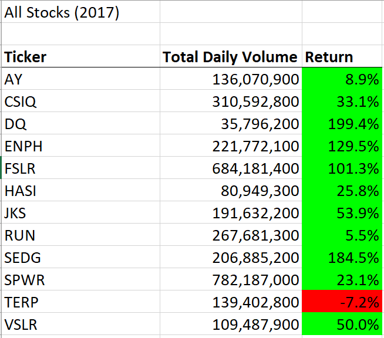

# VBA Module (Stock analysis)

## Overview of Project

### Purpose
The purpose of the stock analysis project is to help Steven and his parents decide if DQ is a good investment. After looking at DQ's stock, the macros were updated to analyze all stocks return of investment by year. The code was refactored to improve performance and show the execution time for each year. 

## Results

During the year 2017, the return of investment for 11 out of the 12 analyzed stocks was positive. In 2018, only 2 out of the 12 stocks analyzed had a positive return of investment ENPH was the most consistent stock during both years. The stock they were interested on, DQ, had a 199.4% of return of investment in 2017 but went down to -63% in 2018 so it's more risky to invest in. 

For execution times, 2018 was faster with being executed in only 0.1796875 seconds. The execution time for 2017 was 0.2109375 seconds. 

### 2017 Stock Analysis and Execution Time

### 2018 Stock Analysis and Execution Time

### Summary

The advantages of refactoring code would be to improve the execution times, make the design look better, and by having that extra set of eyes can be helpful to find and fix bugs. A disadvantage at this moment would be the experience of the person that is refactoring might be new and not have enough knowledge to actually make improvements. These pros and cons were applied to refactoring the VBA script provided. The cons were that the execution time did improved and also the presentation by making the letter bold. The cons would be that my knowledge at this moment is more limited so there might be better practices to refactor code. 

